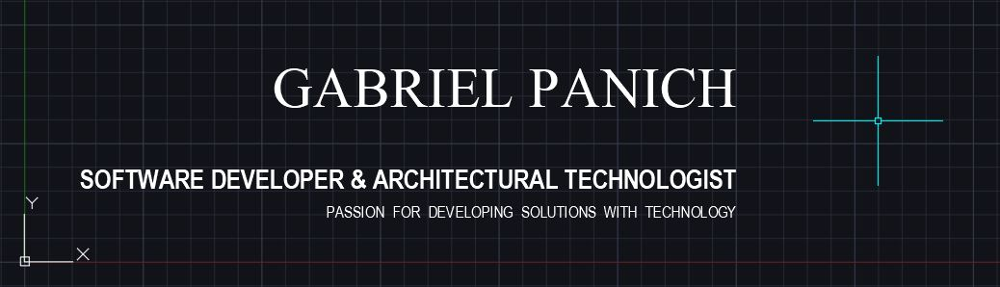

<h2 align="left">Hi, I'm Gabriel👋</h2>
<h4 align="left">I'm a Full-Stack Software Developer and Architectural Technologist from the National Capital Region of Canada.</h4>
//

- 🌱 I’m currently learning **JavaScript, React, Node.JS, MongoDB**

- 💬 Ask me about **JavaScript, CSS, HTML, CAD/BIM**

- ⚡ Fun facts: 
                 By day, I produce technical drawings for architectural and engineering projects of all types, using CAD and BIM software 📐
                 By night, I'm coding my way into Software Development 👨‍💻
                 By every other hour, you can find me skiing, cycling, or playing video games!
               
- 🚀 Connect on: [LinkedIn](https://linkedin.com/in/gpanich)
- 📃 My portfolio is available at [gpanich.netlify.app](https://gpanich.netlify.app/)

<h3 align="left">Languages and Tools:</h3>

  
  
  
   
  
  
    
  

  

&nbsp;

<!---
gabpanich/gabpanich is a ✨ special ✨ repository because its `README.md` (this file) appears on your GitHub profile.
You can click the Preview link to take a look at your changes.
--->
